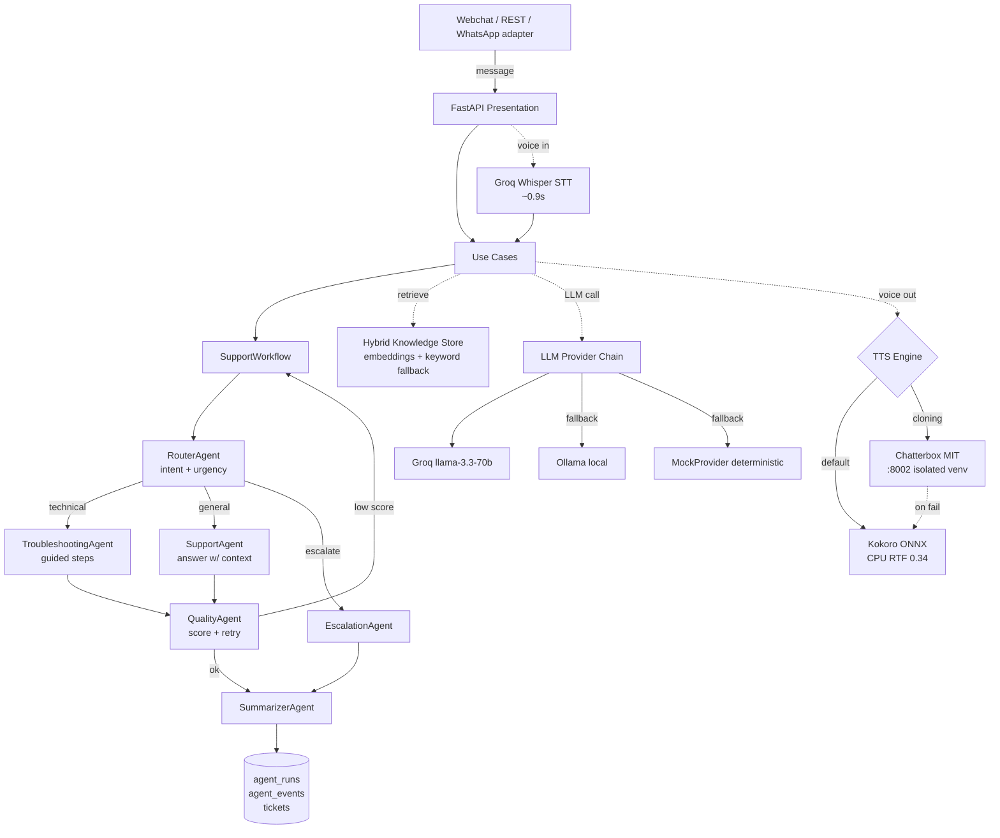

# CallForge

> **Multi-agent voice + LLM customer support platform.** Whisper STT (0.9s) → 6 specialized agents → Kokoro TTS (CPU, RTF 0.34). LLM provider fallback (Groq → Ollama → Mock) for zero-cost offline operation. Clean Architecture, multi-tenant, Windows-service deployable.

[](https://www.python.org/downloads/)
[](https://fastapi.tiangolo.com/)
[](#tests)
[](#)

---

## What this proves

| Capability | Evidence |
|---|---|
| **Production-grade multi-agent orchestration** | 6 specialized agents (Router, Support, Troubleshooting, Escalation, Quality, Summarizer) coordinated via explicit state machine — no LangGraph, no framework lock-in |
| **Voice I/O at production latency** | Whisper STT 0.9s (Groq) + Kokoro ONNX TTS at RTF 0.34 on CPU only — GPU stays free for the LLM |
| **Cost-optimized resilience** | LLM provider chain (`Groq → Ollama → Mock`) keeps the system answering when any provider fails, with $0 floor (local + mock) |
| **Hybrid RAG with graceful degradation** | `nomic-embed-text` embeddings + keyword fallback when embedder is unavailable — lazy backfill for legacy docs |
| **Multi-tenant from day 1** | `tenant_id` scoping in every aggregate, per-tenant API keys, per-tenant metrics |
| **Clean Architecture** | Domain → Application → Infrastructure → Presentation. 100% of tests run offline (MockProvider + SQLite tmp) — no flaky CI |
| **Operational maturity** | Deployable as Windows service via nssm. Alembic migrations auto-stamp pre-existing DBs at boot. Agent runs persist full trace (tokens, cost, latency, confidence, error) |
| **Cloning + voice synthesis** | Chatterbox MIT voice cloning in isolated micro-service (separate venv with torch cu124) avoids GPU contention — auto-fallback to Kokoro if down |
| **LLM specialization roadmap** | QLoRA fine-tune plan documented in [FINETUNE_RUNBOOK.md](FINETUNE_RUNBOOK.md): synthetic dataset → Unsloth/RunPod → GGUF export → Ollama. Specialization > scale for narrow tasks |

**By the numbers** — 8 agents · 9 use-cases · 14 routes · 75 Python modules · 8,403 LOC · 15 test suites (100% offline)

---

## Architecture



Dependency rule: `presentation → application → domain`; `infrastructure` implements domain ports. Endpoints contain zero business logic.

### Message flow (text)

1. **Router** classifies intent, category, urgency, frustration → picks next agent.
2. Knowledge retrieval: keyword + embeddings hybrid (`HybridKnowledgeStore`, similarity floor 0.55 calibrated empirically).
3. **Support** or **Troubleshooting** answers using ONLY that context (anti-hallucination).
4. **Quality** scores the answer. If low → 1 retry with feedback.
5. **Escalation policy** (testable dataclass, NOT inside the agent): quality_threshold, confidence_threshold, max_retries, customer-asked-for-human signal.
6. On escalate → **Escalation** generates handoff brief + **Summarizer** condenses history → creates `Ticket` + `Escalation` row.
7. Everything persists: messages, `agent_runs` (input/output/decision/confidence/latency/model/provider/tokens/cost/error), workflow events, LLM usage.

### LLM fallback chain

```
Groq (cloud, free tier) → Ollama (local) → MockProvider (deterministic)
```

If all fail, workflow returns a controlled message and logs a `fallback_used` event. System never crashes due to LLM unavailability. **Pattern transferable to any LLM-dependent system** ([infrastructure/llm/fallback.py](src/callforge/infrastructure/llm/fallback.py)).

---

## ADN (técnica reusada de proyectos previos)

| Patrón | Origen | Dónde vive aquí |
|---|---|---|
| Agentes + workflows + eventos + trazabilidad | NexusForge AI | `agents/`, `orchestration/`, tablas `agent_runs`/`agent_events` |
| LLM fallback chain con degradación limpia | yt-extract-service (`playbackFallback`) | `infrastructure/llm/fallback.py` |
| Degradación a humano sin romper UX | Verificarro (manual-first) | `EscalationAgent` + `EscalationPolicy` |
| Groq como LLM remoto barato/free | compras-cloud, yt-extract `/recommend` | `GroqProvider` |
| Verify-before-ship con tests por fase | Spacetime Lab | `tests/` (100% offline con MockProvider) |
| Despliegue local como Windows service | yt-extract-service | `scripts/install-windows-service.ps1` (nssm) |

---

## Quick start (zero cost default)

```powershell
python -m venv .venv
.\.venv\Scripts\Activate.ps1
pip install -e ".[dev]"
copy .env.example .env
python main.py        # http://localhost:8000/docs
```

Without configuring anything, responds with `MockProvider`. For real answers:
- Set `GROQ_API_KEY` in `.env` (free tier), or
- Run Ollama locally (`ollama run llama3.1`).

### Docker

```bash
docker compose up --build
docker compose --profile postgres up   # opt-in Postgres
```

### Voice

Whisper STT (Groq) + Kokoro TTS (CPU) work out of the box. For voice cloning with Chatterbox:

```powershell
python -m venv .venv-voice
.\.venv-voice\Scripts\python.exe -m pip install \
  torch==2.6.0+cu124 torchaudio==2.6.0+cu124 \
  --index-url https://download.pytorch.org/whl/cu124
.\.venv-voice\Scripts\python.exe -m pip install chatterbox-tts
.\.venv-voice\Scripts\python.exe -m uvicorn voice_server:app --port 8002
```

Endpoints:
- `POST /api/v1/voice/tts` — text → WAV
- `POST /api/v1/conversations/{id}/voice-message` — audio → STT → workflow → response + spoken reply
- WebChat UI at `/webchat` with 🎤/🔊 buttons

---

## Examples (curl)

```bash
# Health
curl http://localhost:8000/api/v1/health

# Ingest knowledge
curl -X POST http://localhost:8000/api/v1/knowledge/documents \
  -H "Content-Type: application/json" \
  -d '{"title":"Reiniciar el modem","content":"Desconecta el modem 60s y reconecta.","tags":["internet"]}'

# Start conversation
curl -X POST http://localhost:8000/api/v1/conversations/start \
  -H "Content-Type: application/json" \
  -d '{"customer_external_id":"cliente-42","customer_name":"Ana"}'

# Send message (use the returned conversation_id)
curl -X POST http://localhost:8000/api/v1/conversations/<ID>/message \
  -H "Content-Type: application/json" \
  -d '{"content":"Mi internet no funciona desde ayer"}'

# Read conversation / tickets / metrics
curl http://localhost:8000/api/v1/conversations/<ID>
curl http://localhost:8000/api/v1/tickets
curl http://localhost:8000/api/v1/metrics
```

If `API_TOKEN` is set in `.env`, add `-H "X-API-Token: <token>"` to each request (`/health` stays open for probes).

---

## Tests

```bash
pytest
```

All 15 test suites run offline with `MockProvider` + SQLite in tmp. Coverage: router, fallback chain, end-to-end conversation flow, escalation policy + flow, knowledge retrieval, health/metrics/feedback, API-token gate.

## Roadmap

- ✅ Alembic migrations embedded, auto-stamp at boot
- ✅ Hybrid retrieval (embeddings + keyword) with empirically-calibrated 0.55 floor
- ✅ Guided resolution: `ResolutionStep` persistent — Troubleshooting agent sees prior steps, never repeats
- ✅ Webchat (`/webchat`) + WebSocket (`/webchat/ws`) reusing same use cases
- ✅ Dashboard (`/dashboard`) over `/metrics` + tickets tray, auto-refresh
- ✅ Multi-tenant: `tenants` table + `tenant_id` scoping in repos, per-tenant API keys + metrics
- ✅ QLoRA fine-tune runbook ([FINETUNE_RUNBOOK.md](FINETUNE_RUNBOOK.md)) — Unsloth + RunPod + GGUF for Qwen3-4B specialization
- 🚧 WhatsApp / email channel adapters (Meta/SMTP creds required; pattern documented in `routes/webchat.py`)
- 🔮 Redis session/response cache (deferred until volume justifies)
- 🔮 Dedicated vector DB (ChromaDB/FAISS) when corpus exceeds ~thousands of docs

See [ROADMAP_VOZ.md](ROADMAP_VOZ.md), [ROADMAP_LLM_LOCAL.md](ROADMAP_LLM_LOCAL.md), [ROADMAP_FINETUNE.md](ROADMAP_FINETUNE.md) for phase-by-phase plans.

---

## Author

**Christian Hernández Escamilla** — AI Engineer · Multi-Agent Orchestration · Voice + LLM systems
[GitHub](https://github.com/christianescamilla15-cell) · christianescamilla15@gmail.com
